[ --> About Me <-- ](https://aduvenhage.github.io/)

# Raytracing
Never did raytracing before, but tried it now and I'm hooked :-)

## Gallery
Some images I have made so far: 

  
  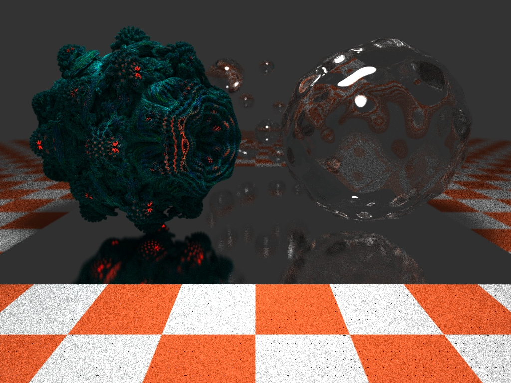
  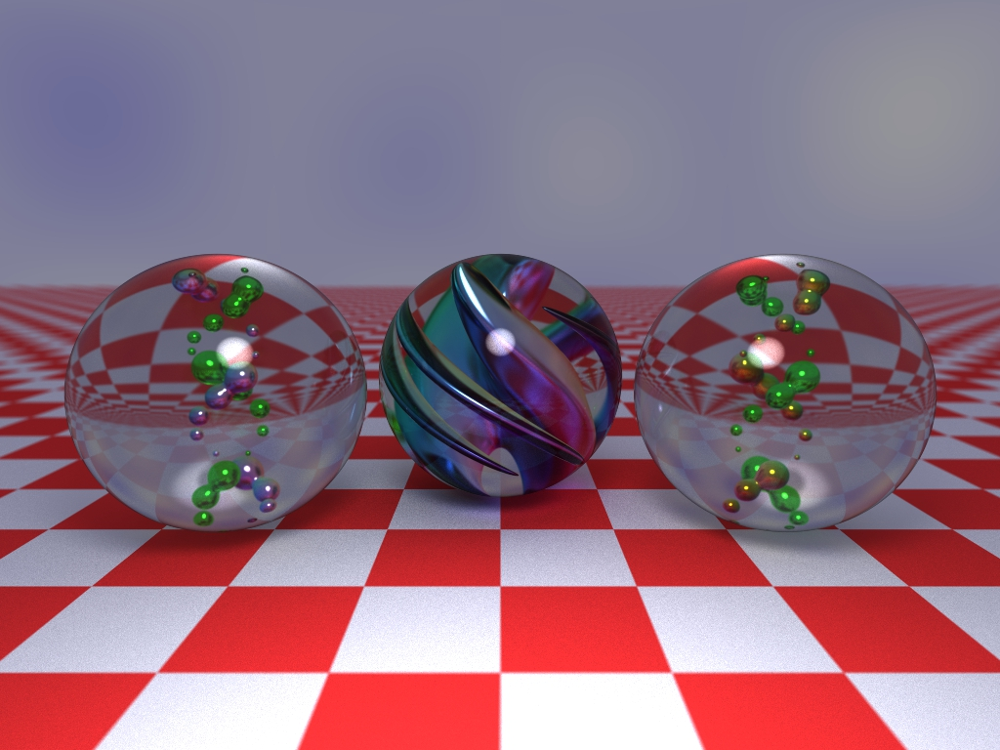
  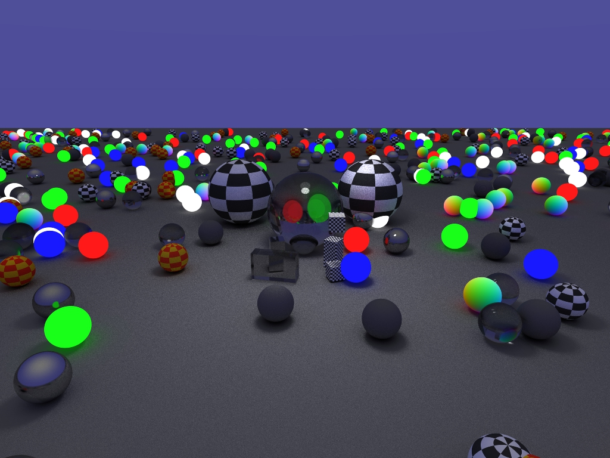
  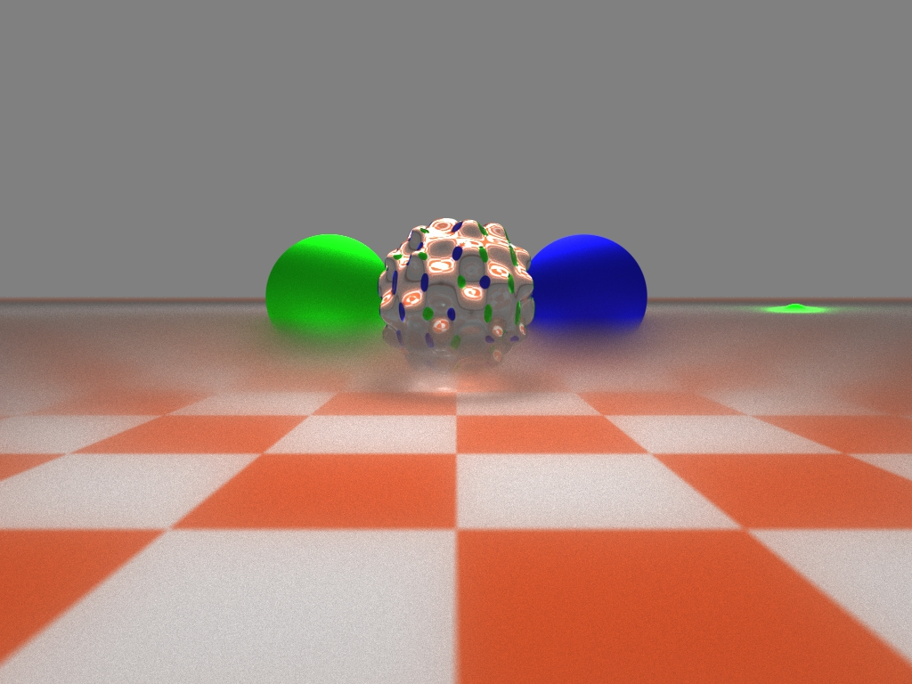
  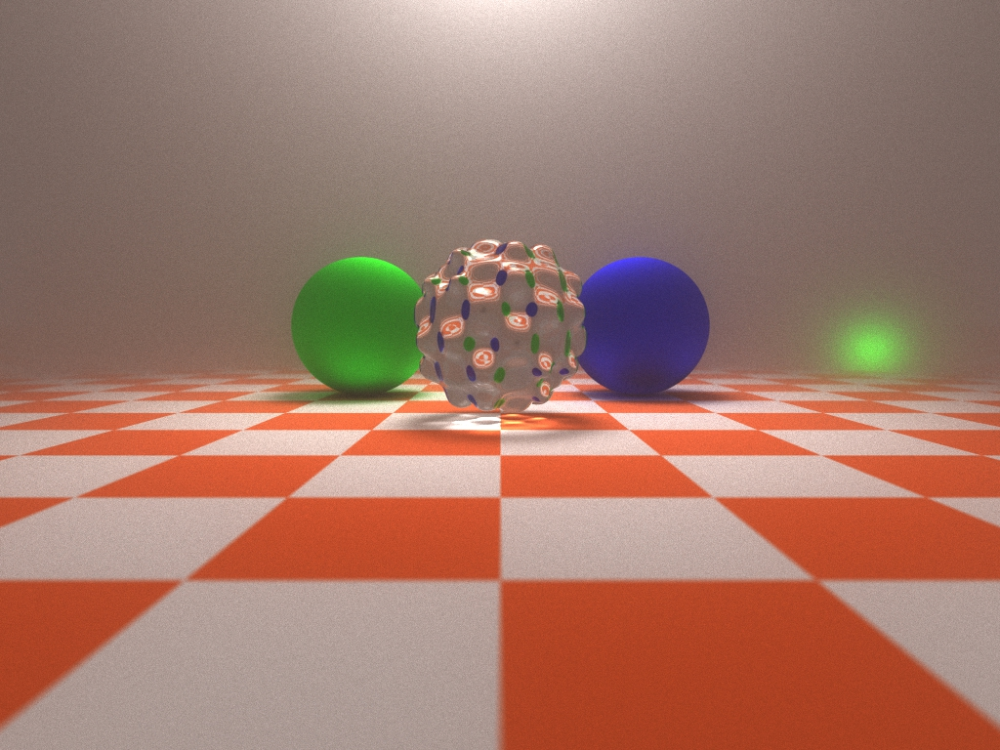
  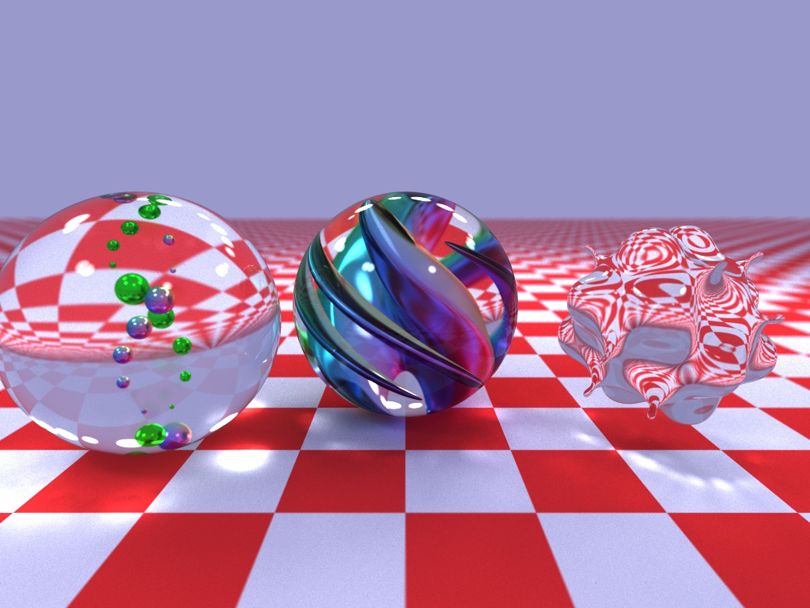
  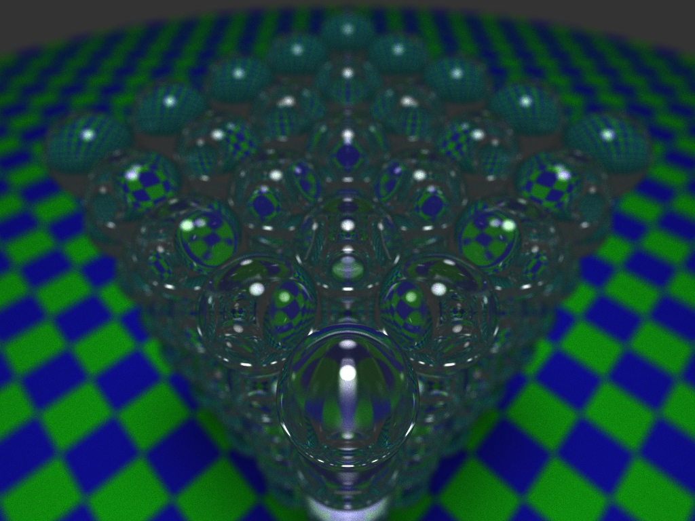
  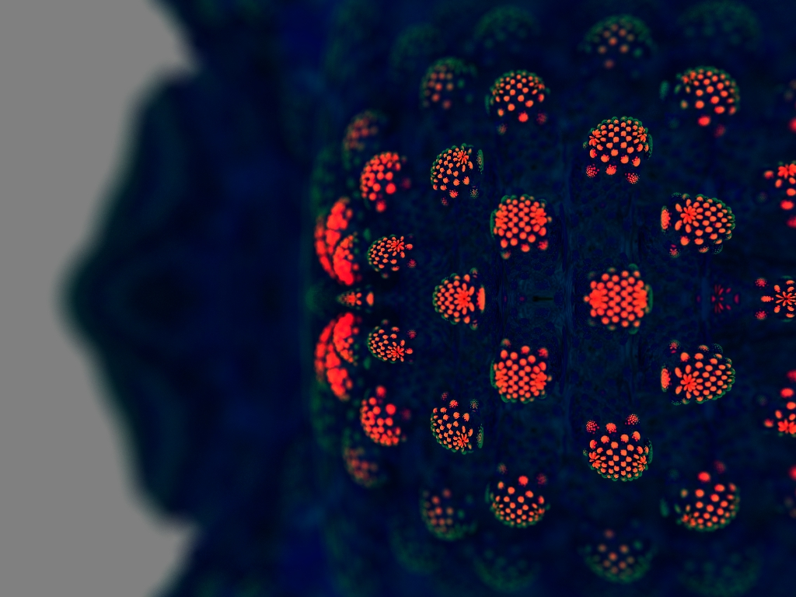
  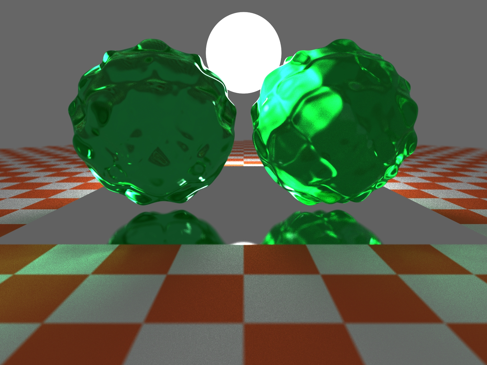
  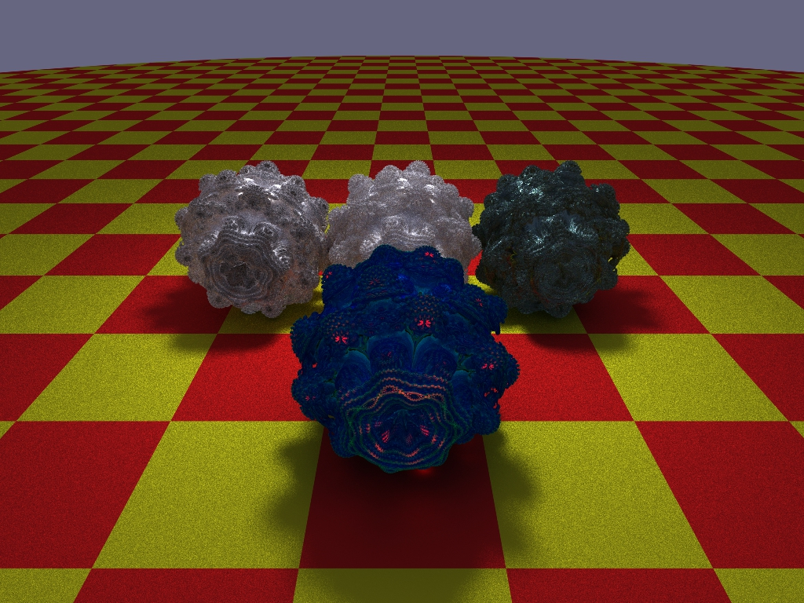
  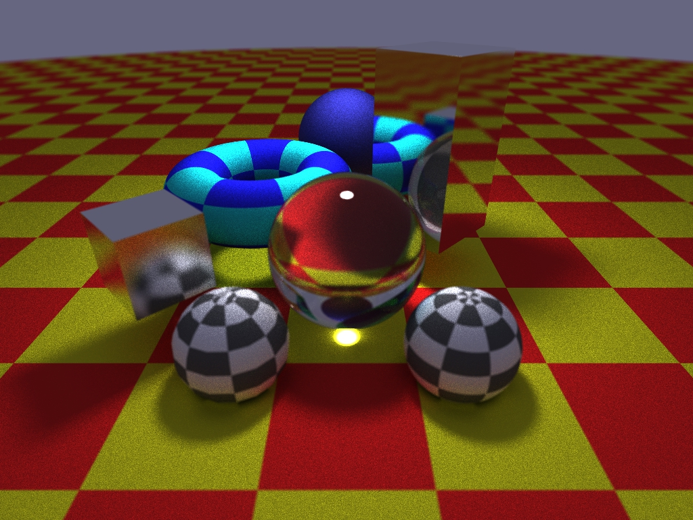
  
  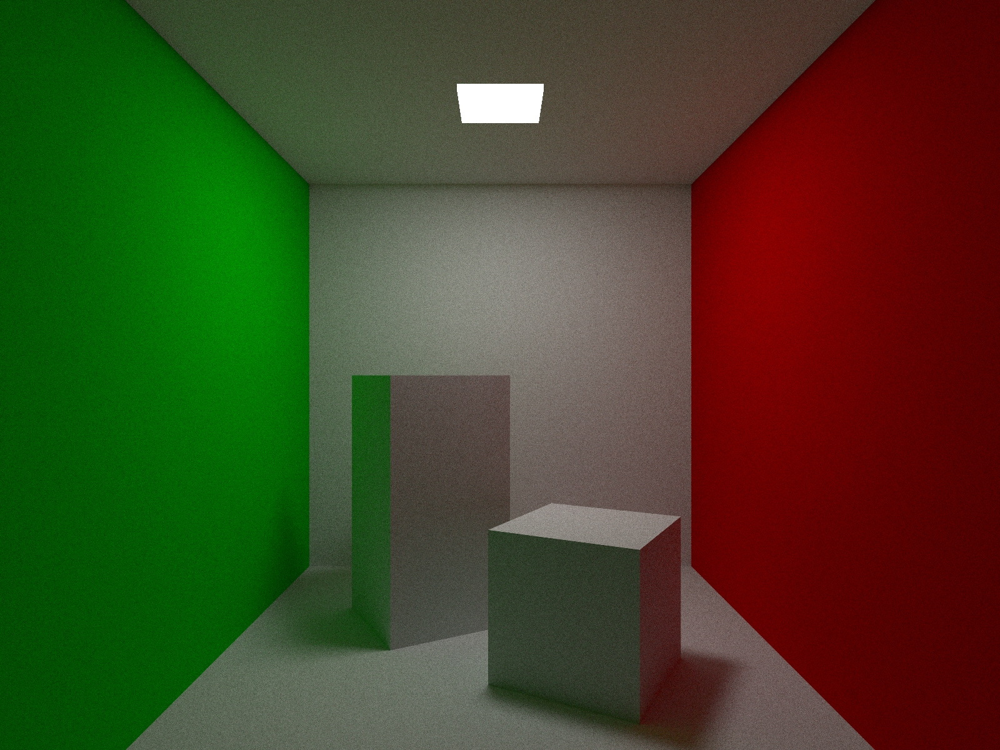
  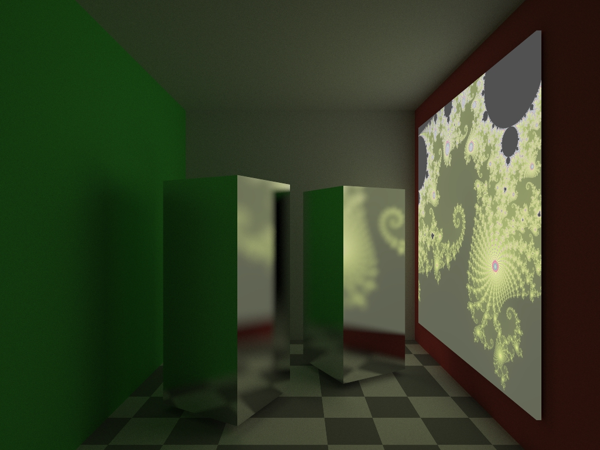

## Features
List of implemented features:s
* Basic Features
  * rays and viewport
  * camera position and orientation
  * depth-of-field
  * gamma correction (fixed 2.0 correction)

* Primitives and Meshes
  * spheres, boxes, planes
  * sphere UV mapping
  * triangle mesh rendering
  * volumes / fog
  * raymarched objects
  * generic materials: diffuse, metal, glass, checkered diffuse
  * procedural materials: fractals, etc.
  * textured objects (texture images)

* Rendering and optimisations
  * monte-carlo based sampling and materials
  * russian roulette early exit
  * multi-threaded rendering
  * rotated and translated objects, and re-used objects (instancing)
  * axis aligned box intersections
  * bounding volume hyrarchy hit optimisations for scene objects
  * bounding volume hyrarchy hit optimisations for triangles within a mesh
  * optional memory manager (optimised small object allocations) to ensure objects are located close together in main memory

* Advanced Features
  * cloud runner (tested on AWS and DigitalOcean)
  * procedural/textured lights

Todo:
* triangle mesh loading (see https://github.com/assimp/assimp)
* procedural content using noise (https://github.com/Auburn/FastNoiseLite)
* replace axis-math with matrix math
* add shadow rays
* optisation through importance sampling (for lights)
* data based optimisations
* de-noising
* z-buffer and rasterised debug views (like viewing BVH volumes)
* support larger scenarios rendering multiple frames or multiple scenes per cloud VM (specific to cloud runner)
* optimize cloud VM promisioning (cloud-local images, smaller images, faster building, etc.)

## Feature blog
Ramblings on cool features and implementation details.  And, actually trying to write something down makes me think of improvements.

- [Rendering with Qt](pages/qt.md)
- [Building with CMAKE](pages/cmake.md)
- [Running in the cloud with docker-machine](pages/docker-machine.md)
- [Raytracing basics](pages/raytracing.md)
- [Random number generation](pages/random.md)
- [Job system](pages/jobs.md)
- [Debugging and compiler settings](pages/compiler_settings.md)

- [Awesome C++] [TODO]
- [Profiling and optimisations](pages/profiling.md) [WIP]
- [Advanced Raytracing](pages/raytracing_advanced.md) [WIP]
- [Hit optimisations using a Bounding Volume Hyrarchy](pages/bvh.md) [WIP]
- [Coordinates, Axis & Matrices](pages/axis.md) [WIP]
- [Camera Model](pages/camera.md) [WIP]

## Resources
- <https://www.realtimerendering.com/intersections.html>
- <https://www.realtimerendering.com/raytracinggems/>
- <https://raytracing.github.io/>
- <https://www.scratchapixel.com/>
- <https://github.com/aras-p/ToyPathTracer>

