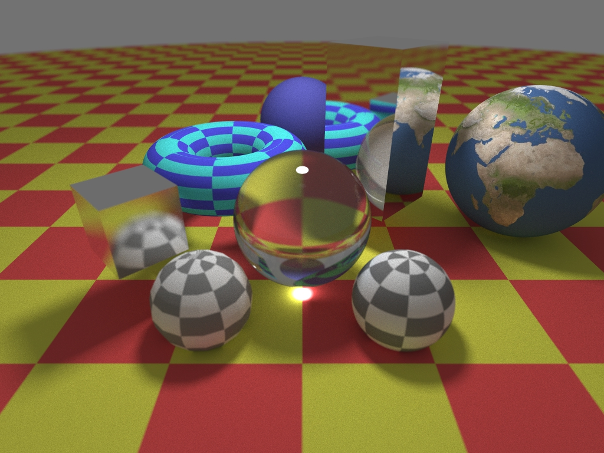

[ --> About Me <-- ](https://aduvenhage.github.io/)

# Raytracing
Never did raytracing before, but tried it now and I'm hooked :-)

## Gallery
Some images I have made so far: 

  
  
  
  
  
  
  
  
  
  
  
  

## Features
List of implemented features:
* Basic Features
  * rays and viewport
  * camera position and orientation
  * depth-of-field

* Primitives and Meshes
  * spheres, boxes, planes
  * sphere UV mapping
  * triangle mesh rendering
  * volumes / fog
  * raymarched objects
  * generic materials: diffuse, metal, glass, checkered diffuse
  * procedural materials: fractals, etc.

* Rendering and optimisations
  * monte-carlo based sampling and materials
  * multi-threaded rendering
  * color variance based per pixel rays (quick exit) 
  * rotated and translated objects, and re-used objects (instancing)
  * axis aligned box intersections
  * bounding volume hyrarchy hit optimisations for scene objects
  * bounding volume hyrarchy hit optimisations for triangles within a mesh

* Advanced Features
  * cloud runner

Todo:
* overloaded memory operations to allocate BVH nodes from a single piece of memory.
* gamma correction
* triangle mesh loading (see https://github.com/assimp/assimp)
* textured objects (texture images)
* textured area lights
* replace axis-math with matrix math
* optisation through importance sampling (for lights)
* data based optimisations
* de-noising
* z-buffer and rasterised debug views (like viewing BVH volumes)
* support AWS and GCP (generic configs) for cloud runner
* support larger scenarios rendering multiple frames or multiple scenes per cloud VM (specific to cloud runner)
* optimize cloud VM promisioning (cloud-local images, smaller images, etc.)

## Feature blog
Ramblings on cool features and implementation details.  And, actually trying to write something down makes me think of improvements.

- [Rendering with Qt](pages/qt.md)
- [Running in the cloud with docker-machine](pages/docker-machine.md)
- [Raytracing basics](pages/raytracing.md)
- [Advanced Raytracing](pages/raytracing_advanced.md) [WIP]
- [Job system](pages/jobs.md) [WIP]
- [Random number generation](pages/random.md) [WIP]
- [Hit optimisations using a Bounding Volume Hyrarchy](pages/bvh.md) [WIP]
- [Coordinates, Axis & Matrices](pages/axis.md) [WIP]

## Resources
- <https://www.realtimerendering.com/intersections.html>
- <https://www.realtimerendering.com/raytracinggems/>
- <https://raytracing.github.io/>
- <https://www.scratchapixel.com/>
- <https://github.com/aras-p/ToyPathTracer>

