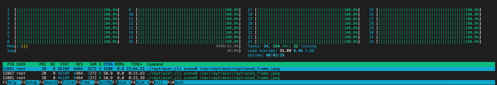

# Running in the Cloud
With docker we can containarise our software, which helps with deployability of software.
Check out docker <https://www.docker.com/> and docker-machine <https://docs.docker.com/machine/> for background.

With docker you can run and mangage containers locally as well as remotely.  In the remote case the docker CLI essentailly points to the remote docker-engine.
Additionally docker-machine helps provision new instances of machines on cloud services, like DigitalOcean, and AWS and helps maintain some local config (in the environment)
to easily switch between different remote connections.

I'm using DigitalOcean for my raytracing cloud runner, since I really like their simple and clean interfaces and APIs.  Also the VMs are called Droplets.
Now I can render a scene with 32 cores, which is much quicker than running on my laptop locally.  Though you have to be carefull
of the pricing of the higher end VMs :-)

## Installing docker-machine
The install on my macbook was straightforward:
- Docker: download docker desktop from <https://www.docker.com/products/docker-desktop>
- docker-machine: brew install docker-machine, doctl
- create API token: <https://cloud.digitalocean.com/account/api/tokens>
- login on API: `doctl auth init -t $TOKEN`
- list droplet sizes: `doctl compute size ls`
  for example:
  ```
  Slug                  Memory    VCPUs    Disk    Price Monthly    Price Hourly
  c-4                   8192      4        50      80.00            0.119050
  c-32                  65536     32       400     640.00           0.952380
  ```

## Using docker-machine
- create VM (ubuntu 18.04 LTS -- Digital Ocean):
  ```
  docker-machine create --driver digitalocean --digitalocean-image ubuntu-18-04-x64 --digitalocean-region sfo3 --digitalocean-size c-32 --digitalocean-access-token=$TOKEN --engine-install-url "https://releases.rancher.com/install-docker/19.03.9.sh" raytracer
  ```
- activate docker env: `eval $(docker-machine env raytracer) .`
- deactivate docker env: `eval $(docker-machine env -u)`
- ssh into remote machine: `docker-machine ssh raytracer`
- list machines: `docker-machine ls`
- remove machines: `docker-machine rm raytracer`
- provision a system: docker-machine (create --> eval ... --> docker-compose up)


## Cloud Runner
I created a python script to automate the docker-machine calls and I also created a CLI version of the raytracer app.
For this cloud runner I also revived an older project of mine <https://github.com/aduvenhage/docker-machine-api> to automate the docker-machine calls.

Running on Digitial Ocean using all 32 cores:<br>
<p float="left">
  
</p>

The script goes through the following steps:
- provision/start VM: docker-machine integrates with the cloud provider API to create the appropriate VM and install docker remotely.
- get machine IP: Get VM IP (not used for anything at the moment).
- get machine environment variables: Get docker-machine env variables required for docker to interact with remote VM.  These variables are passed in with each sub-process call so that they apply to the process's environment, which is required for docker commands to apply remotely.
- get machine status: Check if machine is running or not.
- run services: Do a 'docker-compose up' call that runs the raytracer_cli application once.
- secure copy from machine: Copy output image from remote VM back to local host.
- stop machine: Stop remote VM.
- kill machine: Terminate remote VM.
- remove machine: Delete remote VM and cleanup local docker-machine state.

Running in the cloud, you can get much more resources than what is available on a typical laptop, when you need it.  The current script creates the VM, runs one frame and then destroys the VM.  The overhead of creating and managing the VM should be small compared to the rendering of the frame for this to really make sense.  Rendering more than one frame at a time is not yet supported.

## Some results
For testing I used a scene of stacked glass balls.


The following table shows rendering results on my Macbook and on different DigitalOcean droplets:

| VM Type | Timing (s)
| DO c-2 | 420 |
| DO c-4 | 223 |
| macbook pro 2017 (8 cores) | 115 |
| DO c-8 | 110 |
| DO s-8vcpu-16gb-intel | 110 |
| DO s-8vcpu-16gb-amd | 87 |
| DO c-16 | 59 |
| DO c-32 | 32 |
| DO g-32vcpu-128gb | 30 |
| DO gd-40vcpu-160gb | 32 |


NOTE: These results exclude the overhead of provisioning and deleting the remote VMs.
It clearly shows how well raytracing can scale with more cores and the results on DigitalOcean match quite well with the results on my macbook.

I also tried various droplet types:
- Basic Shared (s): not dedicated, but better hardware than other types
- CPU-Optimized (c): dedicted, but older generation hardware
- General Purpose (g): general purpose (somewhere in the middle) droplets
- General Purpose Dedicated (gd): general purpose droplets

The raytracing tests use very little memory and disk with mostly short periods of high CPU utilisation.

