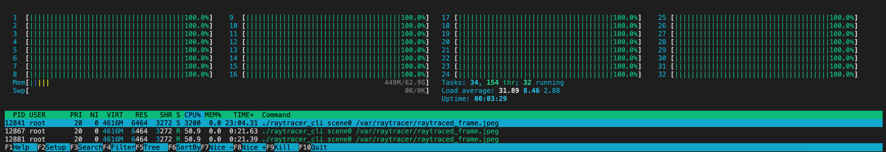

# Job System

## Notes on Performance
Raytracing can typically be distributed very effectively, since the rendering of a pixel does not depend on any other pixel.  It is relatively easy to run the raytracer accross multiple threads:

  

The current implementation renders lines in the output image concurrently, where each line is packaged as a 'job' and the jobs are executed by several worker threads.  Having twice as many worker threads as CPU cores provides good results in most cases.

Simple job system with:
- worker threads
- job queue
- only one type of job

## Architecture

## Frame Stats
